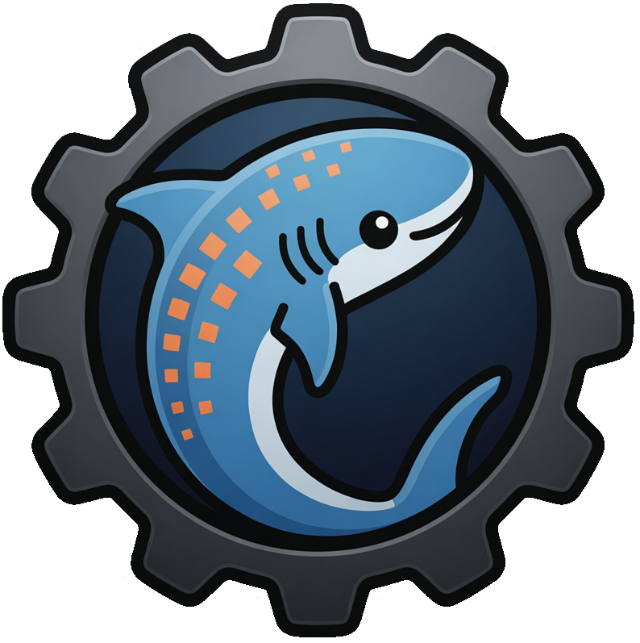

<div align="center">
  <!-- Large Hero Image -->
  
  
  <h1>Akuapkg</h1>

  <!-- Airy Technical Description -->
  <p>
    <samp>
      Cloud-native packaging in one binary &bull; Typed packages<br>
      Sandboxed renders &bull; Signed by default
    </samp>
  </p>

  <br>
  
  <!-- Badges -->
  <p>
    <a href="https://github.com/akua-dev/akuapkg/releases/latest"></a>
    <a href="https://www.npmjs.com/package/@akua-dev/sdk"></a>
    <a href="./LICENSE"></a>
  </p>
  
</div>


  <br>

<p align="center">
  <a href="docs/assets/hero.mp4" title="Watch the 1080p MP4 (52 s)">
    
  </a>
</p>

---

Akuapkg is the Rust package-authoring tool for cloud-native application packages. Its standalone binary is `akuapkg`. The Akua platform CLI is a separate binary named `akua`; it embeds the same package command surface under `akua pkg`.

Packages are authored in [KCL](https://kcl-lang.io). Existing Helm charts and Kustomize bases are callable inside KCL programs, and renders run in a Wasmtime WASI sandbox.

```sh
# Standalone package tool
akuapkg render --inputs inputs.yaml --out ./deploy

# The same operation through the Akua platform CLI
akua pkg render --inputs inputs.yaml --out ./deploy
```

> **Release availability:** `v0.9.3` is tagged in source but does not yet have published GitHub Release artifacts. Check [Akuapkg releases](https://github.com/akua-dev/akuapkg/releases) before relying on a version-specific binary or package-manager install.

## Quick start

A real Package: typed inputs, an OCI-fetched Helm chart with **typed values**, and a KCL overlay across every rendered resource. No `helm` binary on the machine; no shell-out anywhere.

```toml
# akua.toml — deps are typed; resolver pins them in akua.lock with cosign verification
[package]
name    = "blog"
version = "0.1.0"
edition = "akua.dev/v1alpha1"

[dependencies]
nginx = { oci = "oci://registry-1.docker.io/bitnamicharts/nginx", version = "18.2.0" }
```

```kcl
# package.k
import akua.ctx
import charts.nginx as nginx

schema Input:
    name:     str = "blog"
    replicas: int = 2
    tenant:   str

    check:
        replicas >= 1, "replicas must be >= 1"

input: Input = ctx.input()

# Helm chart called as an alias-method. `nginx.Values` is a generated
# schema, not an untyped dict — typos surface as KCL compile errors.
_workload = nginx.template(nginx.TemplateOpts {
    values = nginx.Values {
        replicaCount     = input.replicas
        fullnameOverride = input.name
    }
    release = input.name
})

# Overlay every rendered resource with a tenant label.
resources = [r | {
    metadata.labels = { "app.cnap.tech/tenant" = input.tenant }
} for r in _workload]
```

```sh
akuapkg render --inputs prod.yaml --out ./deploy   # sandboxed render → raw manifests
akuapkg publish .                                  # cosign-signed OCI artifact + SLSA attestation
```

For cross-Package composition (install one Akua package on top of another, with overlays, filters, and extras), see [`examples/11-install-as-package/`](examples/11-install-as-package/). The [`examples/`](examples/) directory covers Helm, Kustomize, multi-engine, package composition, and the KCL ecosystem.

## Why Akuapkg

- **Sandboxed by default.** Every render runs in a wasmtime WASI sandbox with memory / CPU / wall-clock caps. No shell-out, no `$PATH` lookup, no ambient filesystem. Untrusted Packages are safe to render on shared hosts. Adversarial test suite proves each invariant. See [`docs/security-model.md`](docs/security-model.md).
- **Typed packages, not YAML templates.** KCL has real schemas, real types, real imports. Drift between the value the operator wrote and the value the chart consumed becomes a compile error, not a 3am incident.
- **Embedded engines.** Helm v4 + Kustomize compiled to `wasm32-wasip1` and hosted inside akua. `helm.template(...)` works without a `helm` binary anywhere on your machine. See [`docs/embedded-engines.md`](docs/embedded-engines.md).
- **Signed + attested.** `akuapkg publish` emits cosign signatures and SLSA v1 attestations by default. On pull, the `akua.lock` digest is always verified; cosign + SLSA verification engages, fail-closed, when a `[signing] cosign_public_key` is configured. ECDSA P-256 keyed cosign today; keyless on the v0.3 roadmap.
- **Deterministic.** Same inputs + same lockfile + same akuapkg version → byte-identical output. No `now()`, no `random()`, no env reads in the render pipeline.
- **Compose with the ecosystem.** kpm-published KCL packages (`oci://ghcr.io/kcl-lang/*`) drop straight into `[dependencies]` — `import k8s.api.apps.v1` resolves against the upstream schema bundle. See [`examples/10-kcl-ecosystem/`](examples/10-kcl-ecosystem/).
- **Agent-aware.** Auto-detects supported agent environments, emits `--json`, uses typed exit codes, and ships skill manifests under [`skills/`](skills/) conforming to the [Agent Skills Specification](https://agentskills.io). See [`docs/agent-usage.md`](docs/agent-usage.md).

## Distribution

Published binaries belong to [Akuapkg releases](https://github.com/akua-dev/akuapkg/releases). Verify that the version you need is published before relying on release assets; a source tag alone does not publish them.

```sh
# TypeScript SDK — in-process via napi, no `akuapkg` binary on PATH
bun add @akua-dev/sdk
```

Agent-specific setup: [`docs/agent-usage.md`](docs/agent-usage.md).

## Documentation

| | |
|---|---|
| **Authors** | [Package format](docs/package-format.md) · [Lockfile format](docs/lockfile-format.md) · [Examples](examples/) · [Skills](skills/) |
| **Operators** | [CLI reference](docs/cli.md) · [CLI contract](docs/cli-contract.md) · [SDK](docs/sdk.md) · [Agent usage](docs/agent-usage.md) |
| **Internals** | [Architecture](docs/architecture.md) · [Embedded engines](docs/embedded-engines.md) · [Security model](docs/security-model.md) · [Performance](docs/performance.md) |
| **Project** | [Roadmap](docs/roadmap.md) · [Use cases](docs/use-cases.md) · [Changelog](CHANGELOG.md) |

## Status

**Alpha.** Interfaces may change before v1.0. The live command surface is authoritative in `akuapkg --help`; planned work remains in [`docs/roadmap.md`](docs/roadmap.md).

## Security

The render path is structurally hardened: no shell-out, no `$PATH`, every engine runs inside wasmtime with memory / epoch / filesystem-capability caps. Threat model and disclosure process: [`SECURITY.md`](SECURITY.md). Implementation detail and adversarial-test catalogue: [`docs/security-model.md`](docs/security-model.md).

## Contributing

Issues and small focused PRs are welcome — typos, doc clarity, test coverage, security findings. For larger changes, open an issue first so we can align on shape. See [`CONTRIBUTING.md`](CONTRIBUTING.md) and [`CODE_OF_CONDUCT.md`](CODE_OF_CONDUCT.md).

## License

[Apache-2.0](LICENSE).
